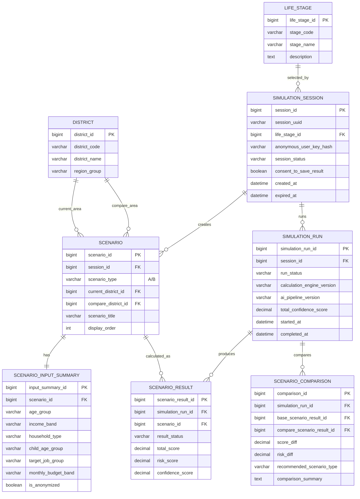

# §1 공통 시뮬레이션 기능 ERD

## 1.1 목적

사용자가 생애 단계를 선택하고, 시나리오 A/B를 만든 뒤, 계산 실행 결과를 저장하는 공통 흐름이다.

## 1.2 구현 메모

- `SIMULATION_SESSION`은 사용자 계정 중심이 아니라 **1회 시뮬레이션 실행 단위**다.
- 원본 입력값은 저장하지 않고 `SCENARIO_INPUT_SUMMARY`에 구간화 요약만 저장한다.
- A/B 비교는 `SCENARIO_COMPARISON`에서 결과 차이와 추천 시나리오를 저장한다.

**레포:** `back/.../db/migration/V1__erd_v4_core_simulation.sql` 와 정렬.
