# §2 주거 기능 ERD

## 2.1 목적

주거비 부담률, 주거 지속 가능성, 공공임대 기회, Red Zone, 회복 레버를 연결한다.

```mermaid
erDiagram
	SCENARIO_RESULT {
		bigint scenario_result_id PK
		bigint scenario_id FK
		decimal housing_score
		decimal disposable_income_score
		decimal risk_score
	}

	THRESHOLD_TYPE {
		bigint threshold_type_id PK
		varchar threshold_code "HOUSING"
		varchar threshold_name
		text formula_version
		varchar unit_default
	}

	THRESHOLD_RESULT {
		bigint threshold_result_id PK
		bigint scenario_result_id FK
		bigint threshold_type_id FK
		varchar threshold_status
		decimal calculated_value "RIR"
		decimal threshold_value
		boolean is_red_zone
		text calculation_summary
	}

	RED_ZONE_RULE {
		bigint red_zone_rule_id PK
		bigint threshold_type_id FK
		varchar rule_code
		decimal trigger_value
		varchar trigger_operator
		text rule_description
	}

	RECOVERY_LEVER {
		bigint recovery_lever_id PK
		bigint threshold_result_id FK
		varchar lever_type "MOVE/BUDGET/POLICY"
		varchar lever_title
		text lever_description
		decimal expected_effect_score
		bigint service_link_id FK
	}

	DATASET_REGISTRY {
		bigint dataset_id PK
		varchar dataset_code
		varchar domain "HOUSING"
		varchar dataset_name
		varchar provider
		varchar source_url
	}

	DATA_SOURCE {
		bigint data_source_id PK
		bigint dataset_id FK
		varchar source_type
		varchar source_file_name
		date base_date
	}

	DATA_SNAPSHOT {
		bigint data_snapshot_id PK
		bigint data_source_id FK
		varchar snapshot_version
		int row_count
		decimal data_quality_score
	}

	THRESHOLD_DATA_PROVENANCE {
		bigint provenance_id PK
		bigint threshold_result_id FK
		bigint data_snapshot_id FK
		varchar used_field
		text calculation_note
	}

	EXTERNAL_SERVICE_LINK {
		bigint service_link_id PK
		varchar link_type "HOUSING"
		varchar title
		varchar url
	}

	SCENARIO_RESULT ||--o{ THRESHOLD_RESULT : has_housing_threshold
	THRESHOLD_TYPE ||--o{ THRESHOLD_RESULT : defines
	THRESHOLD_TYPE ||--o{ RED_ZONE_RULE : has_rule
	THRESHOLD_RESULT ||--o{ RECOVERY_LEVER : suggests
	EXTERNAL_SERVICE_LINK ||--o{ RECOVERY_LEVER : connects
	DATASET_REGISTRY ||--o{ DATA_SOURCE : has
	DATA_SOURCE ||--o{ DATA_SNAPSHOT : snapshots
	THRESHOLD_RESULT ||--o{ THRESHOLD_DATA_PROVENANCE : based_on
	DATA_SNAPSHOT ||--o{ THRESHOLD_DATA_PROVENANCE : supports
```

## 2.2 주거 기능에서 쓰는 데이터

| 데이터 | 사용 목적 | 결과 연결 |
| --- | --- | --- |
| 서울시 전월세가 정보 | 자치구별 평균 월세·보증금·RIR 계산 | `THRESHOLD_RESULT.calculated_value` |
| 서울시 주거실태조사 | 가구 유형별 주거비 부담 보정 | `THRESHOLD_DATA_PROVENANCE` |
| 공공임대 공급계획 | 주거 안정성·공공임대 기회 점수 | `SCENARIO_RESULT.housing_score` |
