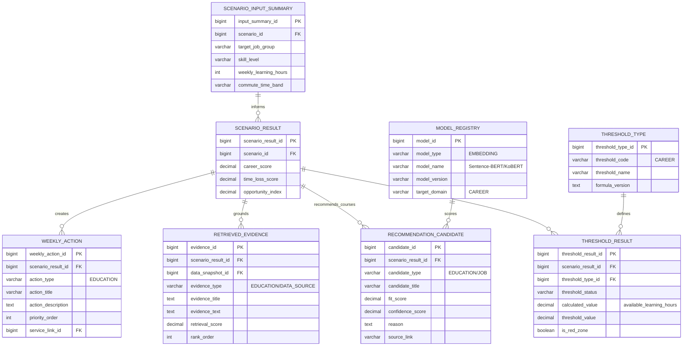

# §3 커리어 기능 ERD

## 3.1 목적

목표 직무, 학습 가능 시간, 교육/일자리 추천, 커리어 임계점, 이번 주 학습 액션을 연결한다.



## 3.2 커리어 기능 계산 흐름

```
target_job_group + skill_level + weekly_learning_hours
→ 교육/채용 텍스트 임베딩
→ Cosine Similarity / Sentence-BERT / KoBERT
→ 추천 교육·일자리 후보
→ 커리어 임계점 판정
→ 이번 주 학습 액션 생성
```
