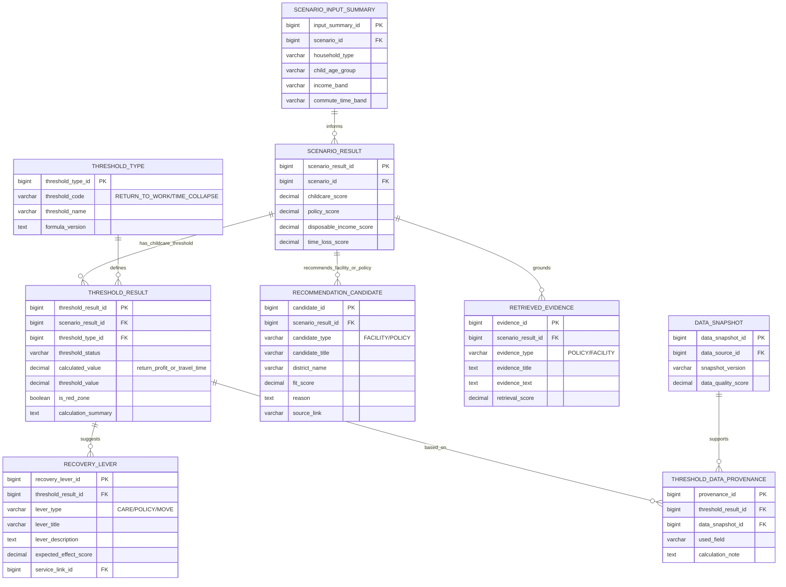

# §4 보육/복직 기능 ERD

## 4.1 목적

자녀 연령, 보육 인프라, 시설 접근성, 복직 순이익, 돌봄 Red Zone을 연결한다.

## 4.2 보육/복직 기능에서 쓰는 데이터

| 데이터 | 사용 목적 | 결과 연결 |
| --- | --- | --- |
| 어린이집 정원현원 충족률 | 보육 공급 점수, 수용 여력 계산 | `SCENARIO_RESULT.childcare_score` |
| 우리동네키움센터 시설현황 | 돌봄 접근성, 시설 후보 추천 | `RECOMMENDATION_CANDIDATE` |
| 몽땅정보 만능키 | 출산·육아 정책 추천, 복직 순이익 보정 | `RETRIEVED_EVIDENCE`, `RECOVERY_LEVER` |
