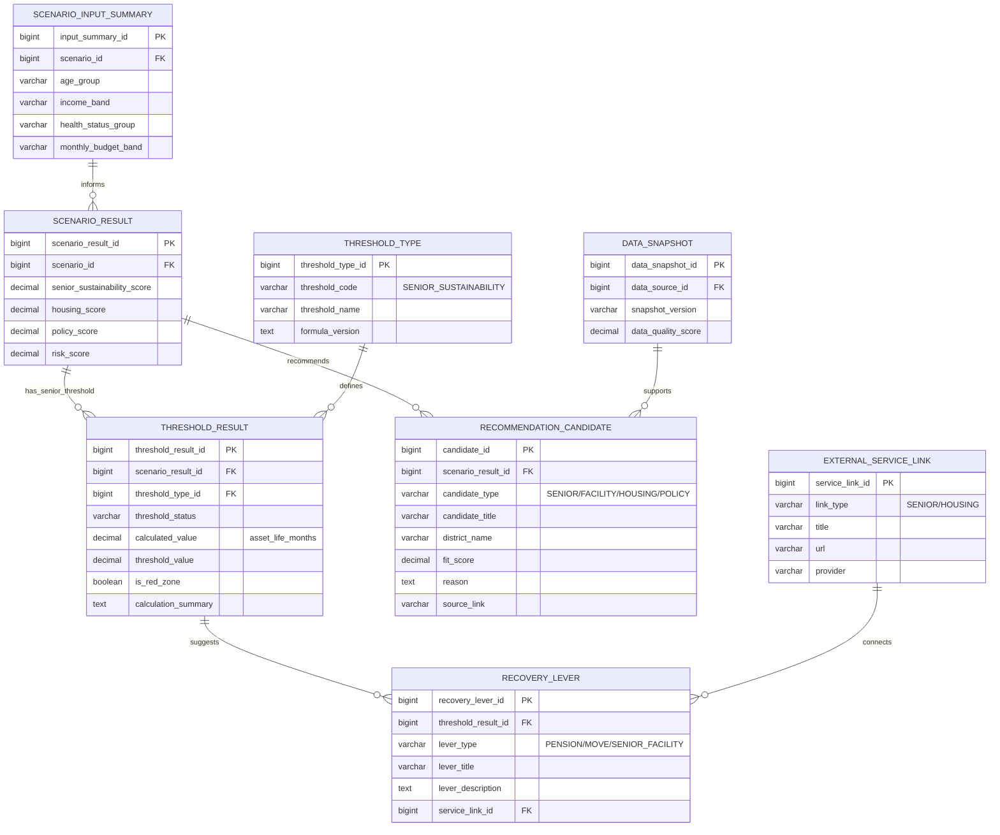

# §5 노년 기능 ERD

## 5.1 목적

노후 자산수명, 주거 유지/다운사이징, 복지시설 접근성, 주택연금·노인복지 링크를 연결한다.



## 5.2 노년 기능 계산 흐름

```
age_group + monthly_budget_band + health_status_group
→ 월 부족분 / 자산수명 계산
→ 노후 지속 임계점 판정
→ 주택연금·다운사이징·복지시설 후보 추천
→ 첫 실행 액션 생성
```
