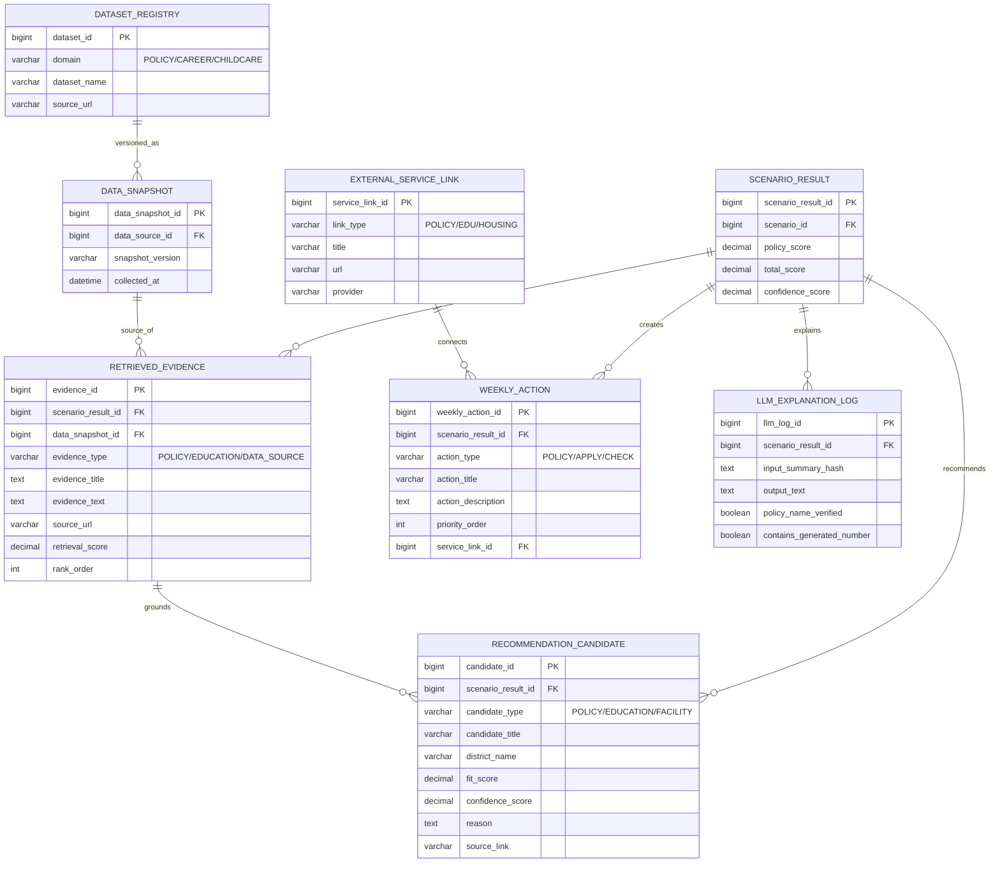

# §6 정책/RAG 기능 ERD

## 6.1 목적

정책 데이터와 사용자 조건을 연결하고, RAG 검색 근거를 추천 후보와 LLM 해설에 전달한다.

## 6.2 RAG 역할 분리

| 구분 | 역할 | 저장 위치 |
| --- | --- | --- |
| RAG | 정책·교육·시설 근거 chunk 검색 | `RETRIEVED_EVIDENCE` |
| 추천 엔진 | 후보명, 적합도, 추천 이유 산출 | `RECOMMENDATION_CANDIDATE` |
| LLM | 계산 결과와 근거를 쉬운 문장으로 설명 | `LLM_EXPLANATION_LOG` |
| 실행 액션 | 이번 주 할 일과 신청 링크 연결 | `WEEKLY_ACTION`, `EXTERNAL_SERVICE_LINK` |
