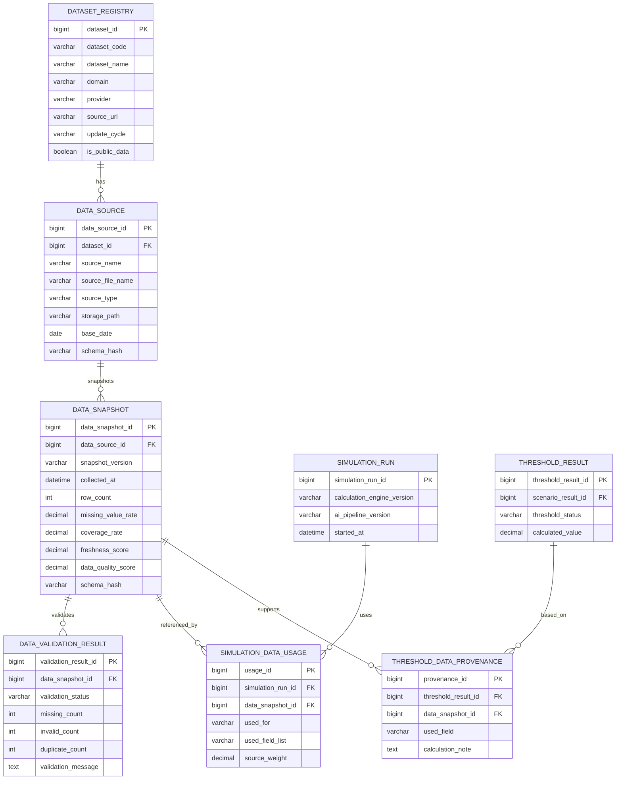

# §7 데이터 출처/스냅샷 기능 ERD

## 7.1 목적

공공데이터 기반 서비스의 핵심인 **출처·기준일·스냅샷·사용 필드·검증 결과**를 관리한다.

## 7.2 화면 연결

- `DataSourcePanel.tsx`는 `DATASET_REGISTRY`, `DATA_SOURCE`, `DATA_SNAPSHOT`을 표시한다.
- `HousingCostCard`, `ChildcareInfraCard`, `PolicyMatchCard`는 `THRESHOLD_DATA_PROVENANCE`를 통해 근거를 표시한다.
- 동일 입력과 동일 스냅샷이면 같은 결과가 나와야 하므로, `SIMULATION_DATA_USAGE`가 재현성의 기준이 된다.
