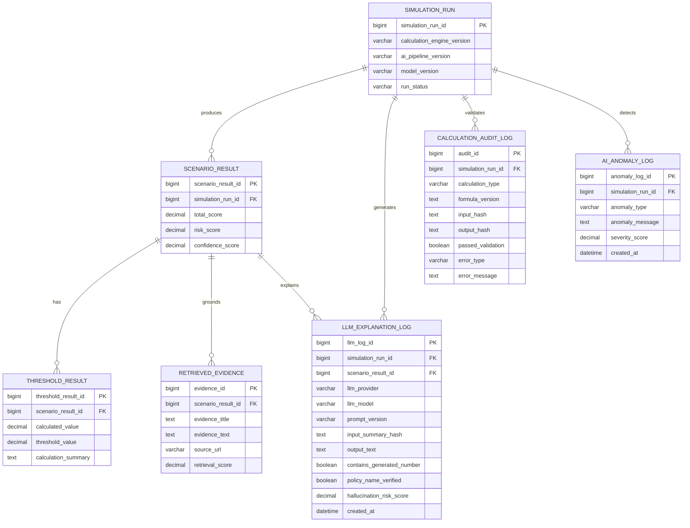

# §8 LLM/계산 검증/로그 기능 ERD

## 8.1 목적

계산 엔진과 LLM의 역할을 분리하고, LLM이 숫자·정책명을 임의 생성하지 않았는지 검증한다.

## 8.2 안전 원칙

| 원칙 | 구현 테이블 | 설명 |
| --- | --- | --- |
| 숫자는 계산 엔진만 생성 | `THRESHOLD_RESULT`, `CALCULATION_AUDIT_LOG` | RIR, 자산수명, 시간붕괴 등 수치는 계산 결과만 저장 |
| LLM은 설명만 담당 | `LLM_EXPLANATION_LOG` | 입력은 결과 요약과 근거 chunk만 허용 |
| 근거 없는 정책명 금지 | `RETRIEVED_EVIDENCE`, `policy_name_verified` | 검색된 정책명만 출력하도록 검증 |
| 이상 응답 감지 | `AI_ANOMALY_LOG` | 환각 위험, 숫자 생성, 근거 누락을 기록 |
